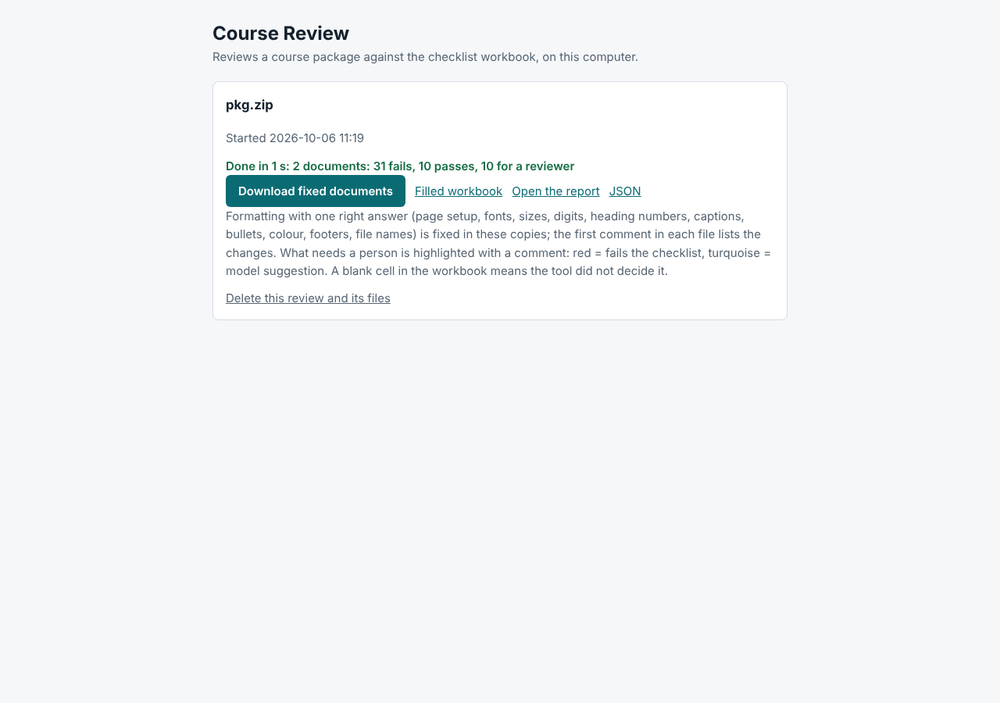
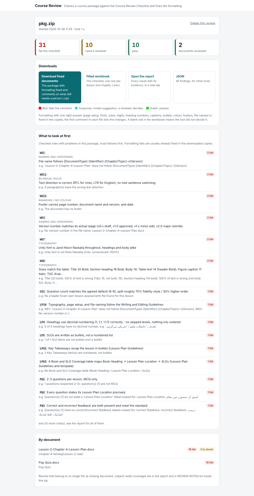
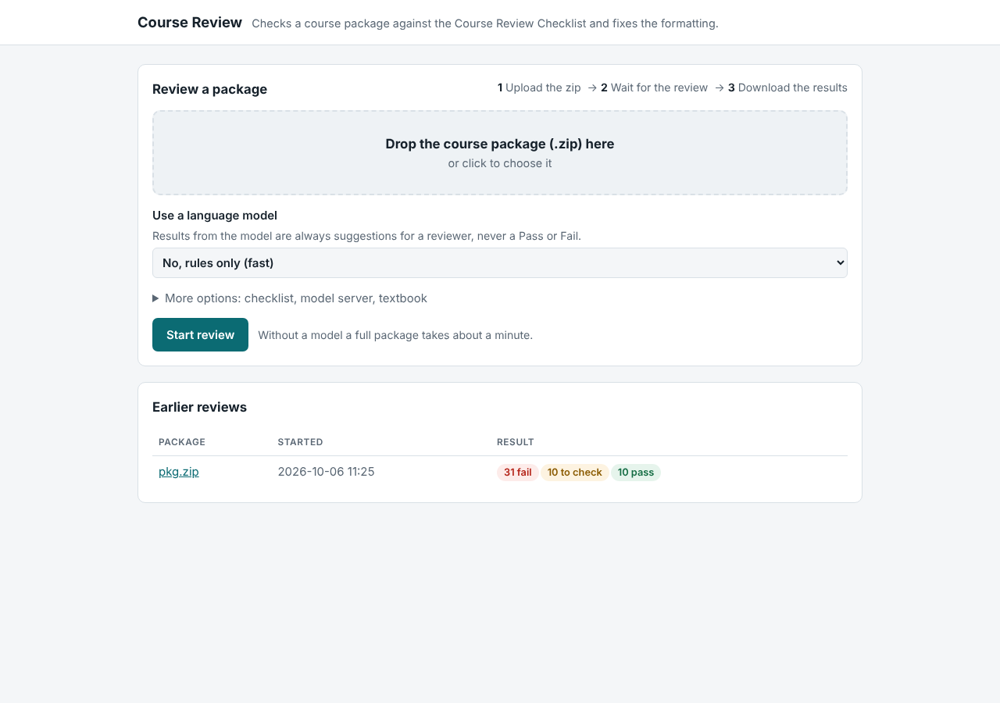

# Fix: no made-up version numbers · Improved web page

Date: 2026-10-06 · Branch: `claude/autofix-keep-unfixed-findings`
Follows [fix-hidden-findings-in-fixed-copies.md](fix-hidden-findings-in-fixed-copies.md).

## 1. The tool no longer makes up a version number

### The problem
When a file name had no version, the fixer renamed it to `...-v0.1` and wrote `v0.1` into the new
footer. That looked like a real version, and it made WE3 ("version number matches its actual
stage") look settled, even though nobody had chosen that version.

### The fix
`autofix.find_version(doc, info)` looks for the document's own version, in this order:

1. the file name (`...-v1.2`);
2. the footer (`v1.2`, `Version 1.2`, `ورژن 1.2`; Urdu digits are read too);
3. the file's properties (the Version field Word and PowerPoint keep);
4. an explicit `Version 1.2` line among the first ten paragraphs.

* **Found:** the new file name and footer keep it, and the "Fixed by the tool" comment says
  where it came from, e.g. "Version v2.1 taken from the footer". WE3 is still shown as a CHECK,
  because a person must confirm the version matches the document's stage.
* **Not found:** nothing is made up. The file is still renamed to the pattern, but without a
  `-v` part (e.g. `Lesson-Plan-Lesson-2-Chapter-4.docx`), and the footer leaves the version out.
  WE1, WE3 and WE25 then keep their Fail comments, so the writer is asked to add the version.

`new_name()` now takes the version as an argument (None leaves the `-v` part out), and
`add_footer()` leaves the version out when there is none. The PowerPoint footer box follows
the same rule.

### Tests (`tests/test_autofix.py`)
* `test_no_version_is_made_up`: no `v0.1` in the name or footer; WE3 FAIL comment kept.
* `test_version_is_taken_from_the_footer`: `Version 2.1` in the footer gives
  `...-v2.1.docx`, a footer with `v2.1`, the "taken from the footer" line and a WE3 CHECK.
* `test_mechanical_rules_pass_after_fixing` now uses a file named `...-v1.2.docx` and checks
  that the version is kept.

## 2. The web page

### Before

* "31 fails" was shown in **green** text, which reads as success;
* no breakdown: only one line of counts, nothing about which rules or documents failed;
* "Delete this review" deleted at once, without asking;
* plain file pickers; the checklist upload, rarely needed, sat in the main form.

### After

**Result page**
* Count tiles in the review colours: red fails, amber needs-a-reviewer, green passes, and the
  number of documents.
* Download cards that say what each file is; the fixed documents are the main button.
* A colour key for the highlights in the documents.
* **What to look at first**: each checklist rule with problems, most fails first, with the rule's
  wording from the workbook (its category shown above it) and one example message.
* **By document**: fails and to-check counts per file, worst first.
* Delete asks for confirmation; a failed review shows the error in a red box with a link back.
* The browser tab shows the package name.

**Home page**

* A large drop zone for the zip that shows the chosen file name and size.
* The checklist upload moved under "More options" (the built-in checklist is the default).
* Earlier reviews show coloured pills (fail / to check / pass, running, could not finish).
* When reviews are running or waiting, the page says so, since reviews run one at a time.

**Everywhere**
* Works in light and dark mode and at phone width (the lists wrap instead of squeezing columns):
  [phone, dark](screenshots/job-page-after-phone-dark.png).
* Visible keyboard focus outlines; no outside scripts, fonts or images (the page still works
  with no internet connection, and the same Content-Security-Policy applies).

### How
All in `course_review/web.py`:
* the `PAGE`, `HOME` and `JOB` templates were rewritten;
* `_overview(res, rules)` builds the per-rule and per-document lists when a review finishes; they
  are stored in the job's `meta.json` with the document count. Reviews made before this change
  have no lists, and their pages simply leave those sections out;
* the home page passes each job's state and counts, and the number running or waiting.

The text the existing tests look for ("Start review", "Download fixed documents", "Filled
workbook", "could not finish" ...) is unchanged. New test in `tests/test_web.py`:
`test_result_page_shows_counts_rules_and_documents`.

Full suite: 201 passed, 11 skipped (the skipped tests need a live model server).
